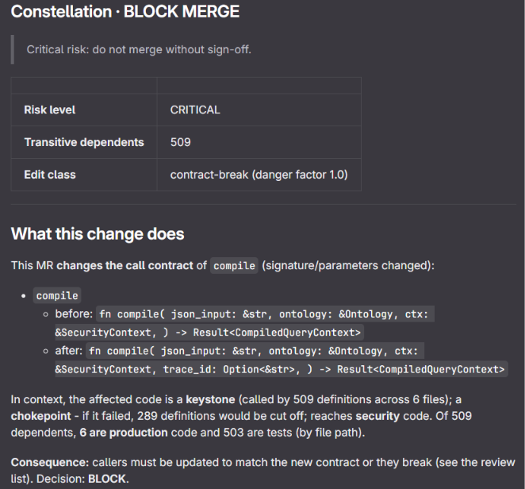
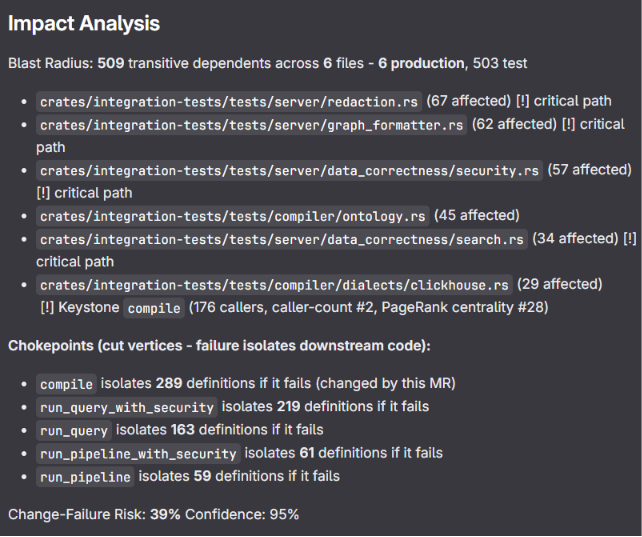
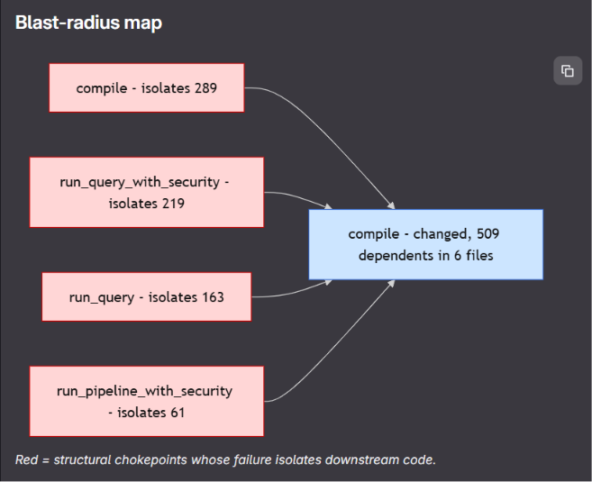
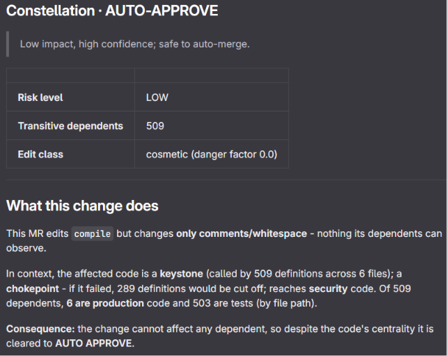
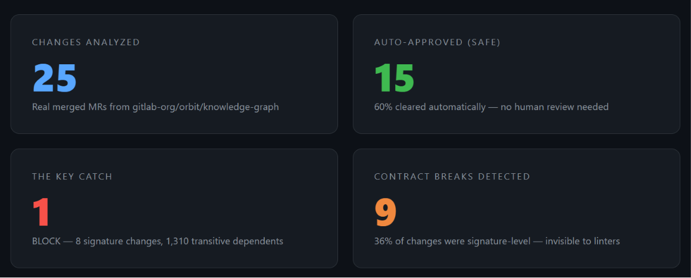
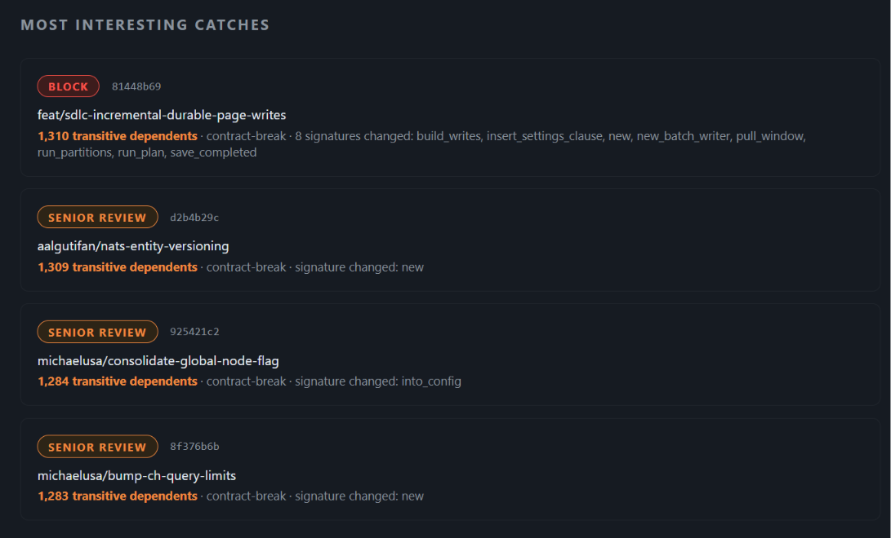

<div align="center">

# Constellation

### Graph-native merge-request intelligence for GitLab

**Constellation reads GitLab Orbit's code-property graph and answers, on every merge request, the questions a senior reviewer would ask but rarely has time to — in under a second, as a comment on the MR, ending in an enforceable decision.**

<p>
  
  
  
  
  
</p>

<sub>Team AeroFyta · GitLab Transcend Hackathon (Showcase Track) · June 2026</sub>

</div>

---

> **A diff tells you *what* changed. Constellation tells you what it *means* — by traversing the dependency graph, not just reading lines.**
>
> It doesn't produce a report. It produces a **Decision Gate**: AUTO-APPROVE the safe changes, BLOCK the dangerous ones. Enforced in CI.

---

## Contents

- [What it does](#what-it-does)
- [See it live — two real MRs](#see-it-live--two-real-mrs)
- [What makes it different](#what-makes-it-different)
- [Backtest — 25 real merged MRs](#backtest--25-real-merged-mrs)
- [Architecture](#architecture)
- [How the CI pipeline works](#how-the-ci-pipeline-works)
- [Project structure](#project-structure)
- [Tech stack](#tech-stack)
- [Quick start](#quick-start)
- [Status — what is real vs. deferred](#status--what-is-real-vs-deferred)

---

## What it does

Constellation runs four lenses off **one shared graph traversal** against GitLab Orbit's DuckDB code-property graph:

| Lens | The question it answers |
|------|------------------------|
| **Impact** | What actually breaks if this changes? (transitive blast radius, keystone detection, structural chokepoints via cut-vertex analysis) |
| **Ownership** | Who carries this, and is the risk dangerously concentrated? (bus-factor, committer distribution) |
| **Compliance** | Does this change cross a security or control boundary? |
| **Provenance** | If there is a vulnerability here, how far does it actually reach? |

The result is not a dashboard. It is a **verdict posted as an MR comment** that a CI pipeline can enforce.

---

## See it live — two real MRs

Both MRs below run Constellation against `gitlab-org/orbit/knowledge-graph` — the same codebase Orbit ships in.

### Case 1 — BLOCK: signature changed on a keystone with 509 dependents

A one-line edit to `compile()` adds a `trace_id: Option<&str>` parameter. Constellation catches it in < 1 s:

<div align="center">

</div>

**What it caught:** `compile` is a keystone (called by 509 definitions across 6 files) and a chokepoint (failure isolates 289 downstream definitions). Adding a parameter is a contract-break with danger factor 1.0. Plain linters and reviewers counting changed lines would pass this — Constellation blocks it.

<div align="center">

</div>

The blast-radius map visualizes the 5 structural chokepoints inside the affected subgraph:

<div align="center">

</div>

> Red nodes = structural chokepoints whose failure isolates downstream code. `compile` itself isolates 289 definitions if it fails. `run_query_with_security` (219) and `run_query` (163) are flagged too — they are not keystones by caller count, but the cut-vertex analysis surfaces them as single points of failure that fan-in counting misses entirely.

---

### Case 2 — AUTO-APPROVE: comment-only edit on the same keystone

The identical function, `compile()`, touched again — this time only a doc comment added above it. Constellation reaches a different verdict:

<div align="center">

</div>

**Why:** The edit-semantics gate classifies the change as `cosmetic` (danger factor 0.0). Despite `compile` being a keystone with 509 transitive dependents, a comment change cannot affect any dependent — so the code's centrality is irrelevant and the change is cleared to AUTO-APPROVE.

**The core insight:** Same function. Opposite verdicts. The distinction is not visible to linters, diff scanners, or rule-based gates — it requires understanding *what kind* of edit was made relative to the graph structure.

---

## What makes it different

**Composition, not four tools in a trench coat.** Impact traverses Orbit **once** and materializes a blast-radius subgraph; Ownership, Compliance, and Provenance consume that object without re-querying. This is asserted by an integration test.

**Real graph theory.** Beyond counting callers, Constellation computes:
- **Cut vertices** (articulation points) — structural single points of failure invisible to fan-in counts
- **PageRank centrality** — identifies keystones by structural importance, not just call frequency
- **Recursive transitive blast radius** — true downstream scope via recursive CTEs over `gl_edge CALLS`

**An edit-semantics gate.** Constellation distinguishes cosmetic (comments, whitespace) from contract-breaking (signature change, type change) edits. A keystone touched by a cosmetic edit clears to AUTO-APPROVE. The same keystone touched by a contract-break gets BLOCKED.

**A control, not a report.** The blended-risk model (`0.6·peak + 0.4·average`, so one critical signal cannot be averaged away) drives a Decision Gate a CI pipeline enforces. Set `CONSTELLATION_ENFORCE=1` and a BLOCK verdict fails the pipeline — the MR cannot merge.

**Honest by construction.** Every verdict carries confidence scores and an evidence trail. Data that needs a live GitLab instance is labelled `representative / pending at deploy` rather than faked.

---

## Backtest — 25 real merged MRs

To validate the Decision Gate outside the demo MRs, Constellation was run against 25 real merged MRs from `gitlab-org/orbit/knowledge-graph`:

<div align="center">

</div>

| Metric | Result |
|--------|--------|
| MRs analyzed | **25** real merged MRs |
| AUTO-APPROVE | **15 (60%)** — cleared automatically, no human review needed |
| BLOCK caught | **1** — 8 signature changes, 1,310 transitive dependents |
| Contract-breaks detected | **9 (36%)** — signature-level changes invisible to linters |
| SENIOR REVIEW | **7 (28%)** — high-centrality changes flagged for expert sign-off |

The most interesting catches:

<div align="center">

</div>

> `81448b69` (`feat/sdlc-incremental-durable-page-writes`) changed 8 function signatures touching 1,310 transitive dependents. It was already merged when the backtest ran — Constellation would have blocked it pending sign-off. The next two SENIOR REVIEW catches each touched 1,280+ dependents via a single signature change invisible to the linter.

---

## Architecture

```
MR opened (GitLab webhook / CI trigger)
      │
      ▼
CI pipeline — extracts changed symbols from MR diff
      │
      ▼
Orchestrator
  └─ Impact agent ──── traverses Orbit once ──► blast-radius subgraph
       │                                              │
       ├─► Ownership agent   ──────────────────────────┤  (no re-query)
       ├─► Compliance agent  ──────────────────────────┤
       └─► Provenance agent  ──────────────────────────┘
              │
              ▼
       Blended risk (0.6·peak + 0.4·avg)
              │
              ▼
       Decision Gate → verdict posted as MR comment
       [AUTO-APPROVE | REVIEW | SENIOR REVIEW | BLOCK]
              │
              ▼
       GitLab Orbit — unified SDLC + code-property graph (DuckDB)
```

---

## How the CI pipeline works

Constellation ships a ready GitLab CI pipeline ([`.gitlab-ci.yml`](.gitlab-ci.yml)) that runs on every MR:

1. Downloads and checksum-verifies the Linux Orbit binary and **indexes the repo** against it.
2. **Extracts the real changed symbols** from the MR diff (mapping diff hunks to Orbit definitions).
3. Runs the four-lens orchestrator and **posts the verdict as an MR comment**, updating in place on reruns.
4. Optionally **fails the pipeline on a BLOCK verdict** (`CONSTELLATION_ENFORCE=1`) — turning the gate into a hard merge control.

Setup is one CI variable:

```
Settings → CI/CD → Variables → add  CONSTELLATION_TOKEN
   (project access token, api scope, Reporter role; Masked, NOT protected)
```

A GitLab Duo Agent Platform flow ([`.gitlab/flow.yml`](.gitlab/flow.yml)) is also provided for the agent-platform deployment path.

---

## Project structure

```
constellation/
├── agents/
│   ├── impact/        # blast radius, keystones, chokepoints, PageRank, subgraph
│   ├── ownership/     # bus-factor / concentration (consumes the subgraph)
│   ├── compliance/    # control-boundary detection (consumes the subgraph)
│   └── provenance/    # vulnerability exposure + lineage (consumes the subgraph)
├── orchestrator/
│   ├── orchestrator.py      # composition, blended risk, Decision Gate, markdown
│   └── run_constellation.py # single in-process entry (used by CI + the flow)
├── shared/
│   ├── orbit_real_client.py # Orbit SQL client (recursive CTEs, DuckDB escaping)
│   └── graph_analysis.py    # cut-vertex (articulation points) + PageRank
├── ci/
│   ├── extract_changed_symbols.py  # maps diff hunks → Orbit definitions
│   └── gitlab_post.py              # post/update verdict comment on MR
├── tests/
│   └── integration_test.py  # 5/5 passing on a live Orbit index
├── backtest_report.html     # 25-MR backtest dashboard (open in browser)
├── .gitlab-ci.yml           # merge-request analysis pipeline
├── .gitlab/flow.yml         # Duo Agent Platform flow
└── AGENTS.md                # full system overview + agent contracts
```

---

## Tech stack

**Analysis**


**Graph algorithms (stdlib only — no runtime deps)**

- Recursive CTE over `gl_edge CALLS` — true transitive blast radius
- Tarjan's algorithm — cut-vertex / articulation-point detection
- Power-iteration PageRank — structural centrality over the call graph

**CI / Platform**


---

## Quick start

```bash
# Run the full system on real Orbit data
python demo.py

# Run the integration suite (detects real Orbit binary; falls back to mock offline)
python tests/integration_test.py

# Open the 25-MR backtest dashboard in a browser
start backtest_report.html        # Windows
open backtest_report.html         # macOS
```

No third-party Python dependencies — the full analysis runs on the standard library plus the Orbit CLI.

---

## Validated results (real Orbit data)

Measured against a live Orbit Local index of `gitlab-org/orbit/knowledge-graph`:

| Metric | Value |
|--------|-------|
| Definitions indexed | **16,275** |
| Transitive blast radius (`compile`) | **509** across 6 files |
| Blast-radius query time | **< 60 ms** |
| Top chokepoint | `compile` — isolates **289** definitions |
| Change-Failure Risk (BLOCK case) | **39%** at 95% confidence |
| Integration tests | **5 / 5 passing** on real Orbit |
| Backtest (25 MRs) | **60% AUTO-APPROVE**, **1 BLOCK caught** (1,310 deps) |

---

## Status — what is real vs. deferred

**Real today — validated against a live Orbit index, 5 integration tests, deployed in GitLab CI:**
- All four lenses, the shared-subgraph composition, blended risk, and the Decision Gate
- Recursive transitive blast radius, keystone detection, PageRank centrality, cut-vertex chokepoints
- Edit-semantics gate (cosmetic vs. contract-break), history-scar prior, git-truth ownership
- Changed-symbol extraction from MR diff; verdict posted as MR comment in CI; optional BLOCK-fails-pipeline enforcement

**Deferred — needs a live GitLab/Orbit-Remote instance (not faked, labelled in output):**
- Provenance lineage's `MR → author` half and Compliance's approval/pipeline checks (tables not in Orbit Local)
- Calibrating the change-failure heuristic against real merge/incident history

---

## License

MIT — see [LICENSE](LICENSE).

<div align="center">

**Constellation** · Graph-native DevOps intelligence on GitLab Orbit  
Team **AeroFyta** · GitLab Transcend Hackathon (Showcase Track) · June 2026

</div>
